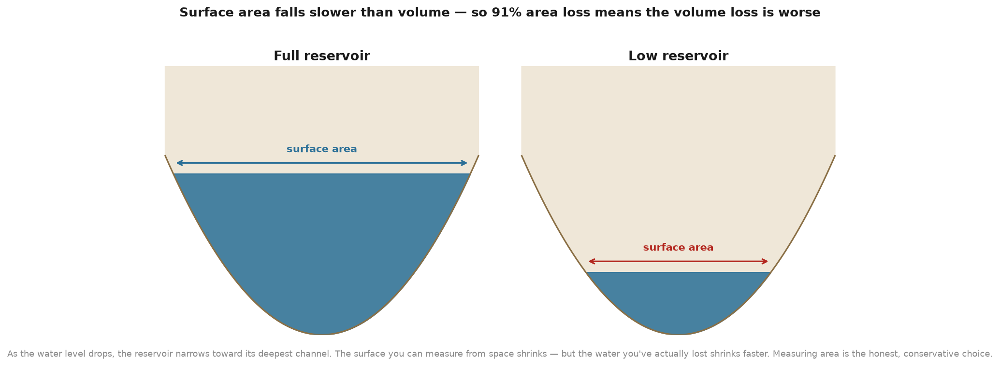
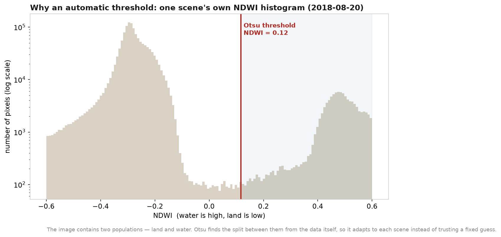

# How and why

*The thinking behind this project — not just what I did, but why I did it that way,
and what I know it can and cannot say. If you only read one file here, read this one.*

I did not want to make a project that looks impressive and means little. Anyone can
render a map now. What I wanted was to **understand** one water crisis well enough to
explain it honestly to someone who has never opened a GIS — and to be able to defend
every choice I made. This file is that reasoning.

## The question I actually asked

Not "can I make a map of Morocco's water?" but: **is the water crisis I keep hearing
about real, is it getting worse, and who does it fall on?** A question, not a
deliverable. Everything below is in service of answering it truthfully.

## Why I measured the reservoir from satellite instead of quoting a statistic

I could have written "Al Massira is nearly empty" and cited a headline. But I would not
have *known* it — I would have been repeating someone else. Measuring it myself, from
imagery anyone can download, is the difference between knowing and understanding. If I
am wrong, someone can rerun my code and catch me. That accountability is the point.

## Why surface area, and what it does *not* tell you

I measured the reservoir's **water surface area**, not its stored **volume**. That was a
deliberate, honest choice — and it has a limit I want to be clear about:

- **Volume** is what actually matters for supply, but computing it needs the shape of the
  reservoir floor (bathymetry), which is not openly available. I refuse to fake precision
  I don't have.
- **Surface area** is something I *can* measure transparently from every image.
- Crucially, area and volume are not proportional. As a reservoir drops, it narrows toward
  the deepest channel, so **volume falls even faster than area.** A 91% loss of surface is
  therefore a *conservative* signal — the volume story is very likely worse, not better.
  I would rather understate and be right than overstate and be caught.

## Why NDWI, and why an automatic (Otsu) threshold

- Water absorbs near-infrared light strongly and reflects green. The **Normalized
  Difference Water Index** (green − NIR) / (green + NIR) turns that physics into one number
  that is high over water and low over land. I used the 10 m green and NIR bands so the
  shoreline stays sharp.
- I did **not** draw the water/land line at a fixed value like NDWI = 0. That looks
  rigorous but is fragile: haze, sun angle, and sediment shift the histogram from year to
  year, so a fixed cutoff quietly measures different things in different images. Instead I
  used **Otsu's method**, which finds the threshold that best separates the two peaks *in
  each image's own histogram*. It adapts to the scene, and it is reproducible — no hand
  tuning, no eyeballing. Understanding *why fixed thresholds fail* is the whole reason I
  chose the adaptive one.

Here is a real histogram from one of my own scenes. There are two clear populations —
dry land on the left, water on the right — and Otsu puts the line in the valley between
them, from the data itself:

## Why dry-season images, and why the same tile every year

I compared **one least-cloudy dry-season image (Aug–Oct) per year**, always from the same
Sentinel-2 tile. This is about comparing like with like. The reservoir naturally rises and
falls within a year; if I mixed spring and autumn images I would be measuring the *season*,
not the *trend*. The dry-season low is also the honest moment — it is when scarcity bites.

## Why I cloud-masked, and why 2017 is the start

- Clouds and their shadows get misread as land or water, so I excluded them using the
  scene's own classification band. An unmasked cloud could invent or erase a lake.
- The series starts in **2017**, not earlier, because that is when Sentinel-2 reached full
  operational coverage. 2016 simply doesn't have reliable dry-season scenes here. That is a
  data limit I'm naming out loud — not a start date I picked to make the story worse.

## Why I kept the recovery in (and updated it to 2026)

The reservoir did not just keep falling. After the 2024 low (~9 km²) it refilled — ~25 km²
in 2025, and ~125 km² by August 2026, *above* its 2017 level, as record rains refilled
Morocco's dams. Leaving that out to keep a scarier chart would have been dishonest, and it
would have missed the real point: **Al Massira's story is not a straight decline, it is
violent volatility** — drought to near-empty, then flood-year rebound. That whiplash, which
a warming climate sharpens, is the actual water-security problem: you cannot run a country's
supply on years that swing from 9 to 125 km². Extending the series to 2026 (rather than
stopping at the dramatic 2024 low) is the honest choice — a story that can't admit a good
year can't be trusted about the bad ones.

## Why I made it about people, not a reservoir

A shrinking blue polygon is easy to scroll past. So I asked the harder question: *who is on
the other end of this pipe?* The answer — 7.7 million people in one region, 96,000 hectares
of farmland, a protected wetland — is what turns a measurement into a reason to care. This
is the part I care about most, and the part no algorithm handed me: deciding that the point
of the map was never the map.

## Why I ran a control on bare desert

This is the decision I would most want to be asked about.

I compared the Souss plain in 2018 and 2026 and the numbers said irrigated land had grown by
46%. I believed it for about an hour. It was wrong, and the reason it was wrong is that 2026 was
an unusually wet year. Rain greens everything, including land nobody farms. My threshold for
"irrigated" was catching scrubland that had simply had a good winter.

So I picked patches of bare desert that had been bare in both years, where nobody irrigates
anything, and measured how much they greened on their own. The answer was 0.09 NDVI. That is
the rainfall baseline: the amount of greening you get for free in a wet year.

Subtracting it flips the result. Land that was already farmland in 2018 comes out 0.25 lower in
2026, not higher. The farms lost ground.

I am putting this first because the lesson is bigger than the number. A before-and-after
comparison is only as good as its control. Without one, I would have published a confident
statement that was the opposite of the truth, and it would have looked perfectly reasonable.

## Why I also matched the seasons

Before the control, there was a simpler error. My first 2018 composite came from late spring and
my 2026 one from early spring. Crops are at different growth stages in April and in February, so
part of what I was calling "change" was just the calendar.

Forcing both years into the same window, 20 March to 15 May, dropped the apparent change from
119% to 46%. Then the control took it the rest of the way. Two corrections, both boring, both
necessary.

## Why I bootstrapped, and why in blocks

Once I had the 0.25 figure I wanted to know how firm it was. The obvious approach is to resample
pixels at random and see how much the answer moves. That would have been wrong too.

Satellite pixels next to each other are not independent observations. They belong to the same
field, the same soil, the same irrigation scheme. Treating hundreds of thousands of them as
independent samples would have produced a confidence interval so narrow it was meaningless,
something like plus or minus 0.001.

So I resampled blocks of land about 3.4 km across instead, which keeps each block's internal
correlation intact. Two thousand resamples gave a 95% range of 0.245 to 0.263, and every single
one came out below zero. The direction is solid. The exact size is not as precise as a naive
method would have claimed.

That range covers sampling uncertainty only. It says nothing about whether my thresholds were
sensible or my labels correct.

## Why one of my tests reports "inconclusive" instead of an answer

The fourth Souss map left an obvious question: why did the farmland lose green? Either the wells
are failing, or the open groves are being replaced by plastic greenhouses, which look dark from
orbit even though the farming underneath has intensified. Those look identical to a vegetation
index but different in the shortwave infrared, so I built a test to separate them.

It gave me an answer: 69% plastic greenhouse. I did not publish that number as a finding, because
I checked something first.

Before trusting a classifier on unknown ground, you can ask whether it can even tell apart the
two reference groups it learned from. Mine managed 67.7%, against 50% for a coin flip. That is
too close to chance to build a claim on, so the script prints INCONCLUSIVE and the repo says the
question is open.

I could have left the check out and reported 69% with a straight face. Nobody would have known.
That is exactly why the check is in there.

## Why I brought in gravity

Everything else in this project watches sunlight bounce off the ground. That is a real weakness,
because the south keeps most of its water underground where no camera can see it, and because
irrigated fields can look healthy right up until the well fails.

GRACE and GRACE-FO measure changes in Earth's gravity, and water is heavy enough to show up. It
is the only measurement here that does not depend on light at all. Both basins are losing water:
Souss-Massa about 0.24 cm a year of equivalent depth, the Oum Er-Rbia about 0.44, over 24 years.

The reason I find it convincing is not the trend. It is the small rise at the very end of the
record, in 2025 and 2026, which matches the rains that refilled Al Massira from 9 km² to 125. A
gravity measurement and a photograph of a lake share no assumptions, no processing and no
physics, and they agreed.

What it is not: GRACE measures total water storage, with snow and rivers and soil moisture and
groundwater added together. It is not a groundwater measurement, and separating groundwater
needs a land surface model subtracted from it, which I have not done. Its footprint is also a
few hundred kilometres, wider than either basin. So it describes the region my valley sits
inside, not the valley.

## Why I cite a paper that answers my own question

While writing this up I found a 2026 study of the Souss-Massa basin that reports groundwater
falling 20 to 65 metres over thirty years, driven by a shift to alfalfa and fodder maize that
need around 800 mm of water a cycle where 99 mm of rain falls. The authors call it the spectral
illusion of crop health: the crisis is masked from space, because irrigated fields can look
green while the aquifer beneath them empties.

That is a direct warning about the method I used, and it points at the answer I could not reach.
I have not changed a single number to agree with it, and my data still cannot prove why the
farmland browned. But it would be dishonest to leave my open question hanging as though nobody
had studied it. Their work is in [REFERENCES.md](REFERENCES.md).

## What I know this project is *not*

Naming limits is how I show I understand my own work:

- It measures **surface area**, a proxy for storage — not volume, and not water quality.
- Al Massira is **one of several** sources for the region; I don't claim it is the only tap.
- The national reservoir fill-rate figures are **reported by authorities/press**, kept in a
  separate, clearly-labelled file — not something I measured.
- It is a **personal open-data project**, not peer-reviewed science. Where I lean on
  published research, I say so in [REFERENCES.md](REFERENCES.md).
- The land-cover classification is **unsupervised**, with labels read off the spectral
  signatures. It is not ground-truthed, and I have never stood in those fields with a GPS.
- The GRACE record is **total water storage**, not groundwater, at a footprint wider than
  either basin.
- The vegetation work measures **greenness, not water**. A canopy can stay green while the
  water table falls, which is the whole point of the study I cite above.

## What I would do next

Since I first wrote this section I have done some of what it asked for. The surface trend is
now paired with rainfall, with 25 years of MODIS vegetation, and with GRACE gravity, and the
four of them agree.

What is genuinely left:

**Separate groundwater from total storage.** Subtracting a land surface model from GRACE would
turn a regional water number into a groundwater number, which is the measurement that would
actually answer why the farmland browned. This is the one I most want to do.

**Radar.** Sentinel-1 sees through cloud, which would give water extent year-round instead of
only in the clear dry season.

**Ground truth.** Every classification here is spectral guesswork with sensible labels. A few
days of fieldwork with a GPS would be worth more than another month of code.

I would still rather add nothing than add complexity that answers no question.

---

*Written by Bouchra Daddaoui. If you're reading this as part of my application: I would be
glad to walk you through any decision here in person. Understanding it is the point.*
