# Running Dry: Mapping Water Stress in Morocco

> I am from the drying south of Morocco, where families are leaving because the water is
> running out. I built this to understand that — honestly, with open data — starting with
> one reservoir I could measure from space, and ending at home
> ([Where I'm from](#where-im-from)).

Morocco is one of the most water-stressed countries in the world. This is a **GIS and
remote-sensing project** — spatial analysis and cartography built from open satellite and
elevation data, fully reproducible from the scripts in `src/`.

**The GIS work in this repo:**
- 🛰️ **Satellite measurement** — the Al Massira reservoir's water surface mapped from
  Sentinel-2 every dry season, 2017–2025 (NDWI + Otsu), and vectorised to a GeoPackage
- 🗺️ **Cartography (QGIS)** — the reservoir's 2017-vs-2024 extent over satellite imagery, a
  community map of who depends on it, and shaded-relief + hypsometric terrain maps
- 🎚️ **Interactive** — a before/after satellite swipe and a scrollytelling StoryMap
- 🌿 **Spatial change analysis** — a vegetation-change (NDVI) map of the drying argan region
- 🧩 **Land-cover classification** — unsupervised K-means of Sentinel-2 into land-cover classes
- 🗄️ **Data management & QA/QC** — an attributed GeoPackage geodatabase (+ AutoCAD DXF), a
  data dictionary, and an automated quality-control report

*The maps are the work. A few plain charts appear only as supporting context.*

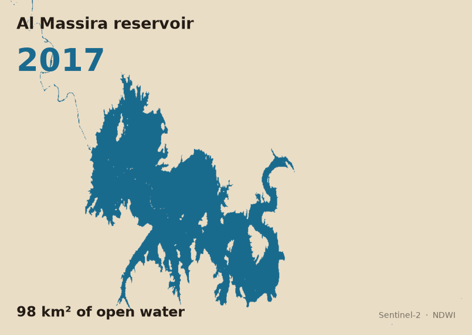

> *The headline result: I measured the Al Massira reservoir's water surface from
> Sentinel-2 satellite imagery, every dry season from 2017 to 2026. It **crashed 91%** to
> a near-empty low in 2024 after years of drought — then **rebounded past its 2017 level in
> 2026** as record rains refilled Morocco's dams. Morocco's water runs in violent extremes;
> the animation above is ten real measurements, not an estimate.
> Full analysis [below](#measuring-the-crisis-from-space-the-al-massira-reservoir).*

**Explore:** **[how & why I made every choice](HOW-AND-WHY.md)** ·
[the analysis](#measuring-the-crisis-from-space-the-al-massira-reservoir) ·
[who depends on it](#who-depends-on-this-water--the-community-connection) ·
[how it connects to research](REFERENCES.md) ·
[narrative notebook](notebooks/morocco_water_stress.ipynb) ·
a scrollytelling StoryMap version (`storymap/index.html`)

> **[HOW-AND-WHY.md](HOW-AND-WHY.md)** is the heart of this repo — the reasoning behind
> every decision, and an honest account of what the analysis can and cannot say. I'd
> rather you understand the *why* than be impressed by the output.

## What the data shows

- **Al Massira reservoir — which supplies Casablanca — crashed 91% to a near-empty
  low in 2024, then rebounded above its 2017 level by 2026**, measured directly from
  Sentinel-2 — a whiplash of drought and flood-year recovery, not a simple decline
  (see [below](#measuring-the-crisis-from-space-the-al-massira-reservoir)).
- **Morocco crossed the international water-stress line (1,000 m³/person/year)
  around the year 2000.** Renewable internal freshwater fell from **2,431 m³ per
  person in 1961 to 777 m³ in 2022** — a 68% drop — and is now closer to the
  "absolute scarcity" threshold of 500 m³.
- **The water didn't shrink — the population did the opposite.** Total renewable
  internal freshwater has been essentially flat (~29 billion m³/year) while the
  population roughly tripled, from ~12 million to ~38 million. The per-capita
  collapse is driven by demand, not by a falling water supply — with drought
  making the *usable* share smaller still.
- **Agriculture uses about 88% of all water withdrawn** (2022), so any serious
  response to water stress is also a conversation about farming, subsidised
  water-intensive crops, and rural livelihoods.
- **The drought is visible in the dams.** Reported national reservoir fill rates
  fell to around **23% in 2024**, down from ~31% in 2023 — the lowest in years.

*(Plain charts of these national indicators are in [supporting context](#supporting-national-context) — but this is a spatial project, so the maps below are the real work.)*

## Measuring the crisis from space: the Al Massira reservoir

The national numbers become concrete in one place. The Oum Er-Rbia rises in the
Middle Atlas, is stored behind the **Al Massira Dam** — Morocco's second-largest
reservoir — and supplies drinking water to **Casablanca** and irrigation to the
**Doukkala plain**. So I measured it directly.

Using **Sentinel-2** satellite imagery, I computed the reservoir's open-water
surface area for every dry season from 2017 to 2026 (NDWI water index + an
automatic Otsu threshold, cloud-masked with the scene classification band). The
result is not a reported statistic — it is a measurement:

**Al Massira's water surface crashed from ~98 km² (2017) to ~9 km² (2024) — a 91%
collapse after years of drought — then rebounded to ~125 km² by August 2026, above its
2017 level, as record 2025–26 rains refilled Morocco's dams. Water security here is about
surviving that volatility, not reading a single downward line.**

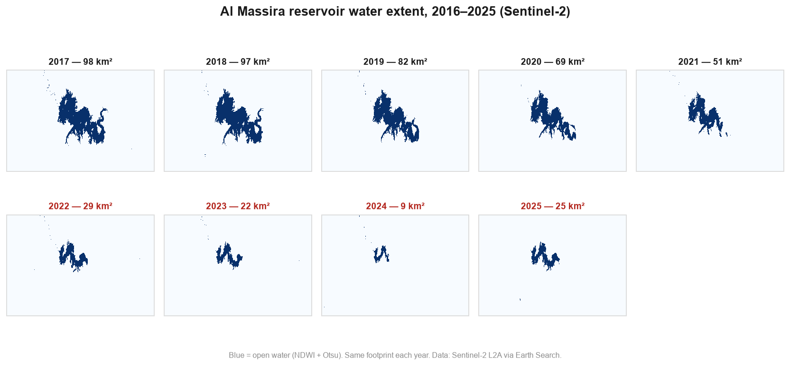

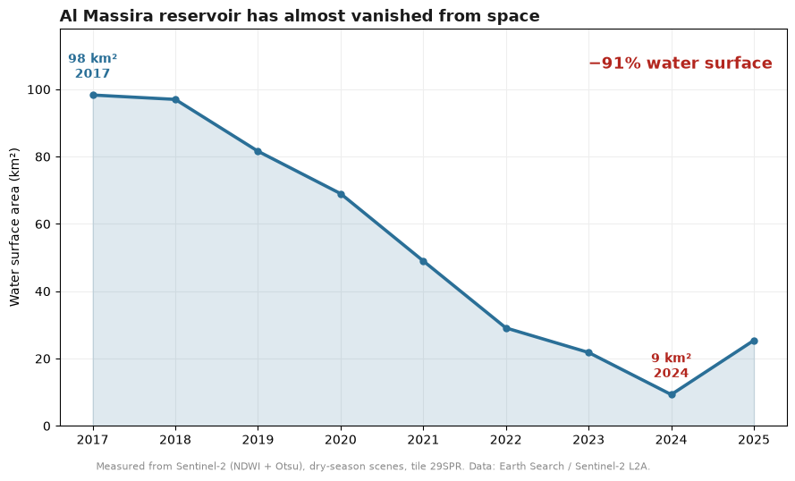

This is built in `src/measure_reservoir.py` (measurement) and
`src/build_reservoir_figures.py` (figures), from public Sentinel-2 L2A data via
the open [Earth Search](https://earth-search.aws.element84.com/v1) STAC API — no
Earth Engine account or paid service required. The method follows the published
remote-sensing literature on Al Massira and other Mediterranean reservoirs.

The water extents are vectorised (`src/export_reservoir_vectors.py`) and mapped
in **QGIS** as a high-resolution print layout (`src/qgis_reservoir_layout.py`,
project `qgis/al_massira_reservoir.qgz`), exported at 300 dpi as PNG and
print-ready PDF. The cyan line is the 2017 shoreline; the blue is what remained in
2024, and the pale ground between them is exposed lakebed:

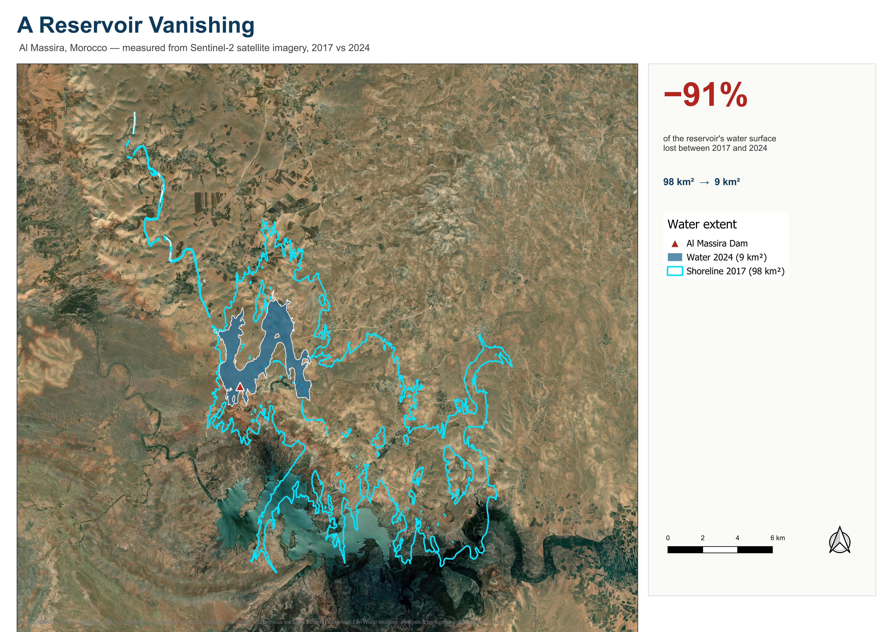

### Who depends on this water — the community connection

A shrinking reservoir is a human story, not just a hydrological one. Al Massira is
a key water source for the **Casablanca-Settat region (7.7 million people, 2024
census)** and irrigates the **Doukkala plain (~96,000 ha of farmland)** through the
Oum Er-Rbia system — and it is a **Ramsar wetland of international importance** for
birds and biodiversity. This QGIS map connects the 91% water loss to the people and
land that rely on it.

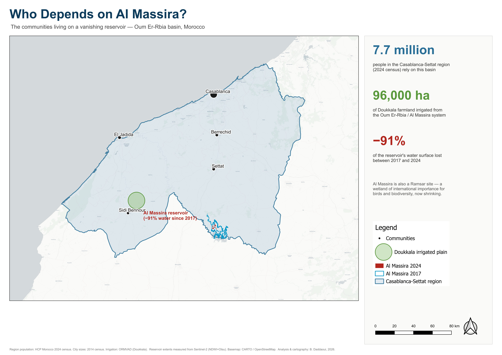

Built in `src/qgis_community_map.py` from open census (HCP Morocco), irrigation
(ORMVAD), and the Sentinel-2 reservoir extents; community figures are documented
with sources in `data/raw/communities_al_massira.csv`.

### Following the water to the fields — Doukkala crop stress

Al Massira exists to irrigate the **Doukkala plain (~96,000 ha)** — so did the reservoir's
crash actually reach the crops? I measured crop moisture (Sentinel-2 **NDMI**) on the Doukkala
fields and found they were moisture-stressed through the drought (2019–2025) and recovered
strongly in 2026 — tracking the dam. This QGIS map shows the recovery (2024→2026) across the
irrigated plain; the green is the fields coming back after the rains returned.

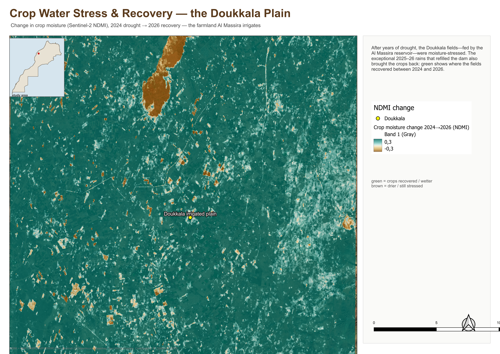

Built in `src/measure_crop_stress.py` (Sentinel-2 NDMI time series) and `src/qgis_crop_stress.py`
(a professional QGIS print layout). This closes the loop: **reservoir → farmland → food.**

### The physical story: where the water comes from

Al Massira does not make its own water — it catches it. This shaded-relief map uses
a **hypsometric tint over a hillshade** (the technique behind award-winning physical
cartography) built from the open **Copernicus 30 m DEM**, to show how Middle Atlas
snowmelt drains down the Oum Er-Rbia into the reservoir, and from there toward
Casablanca and the coast.

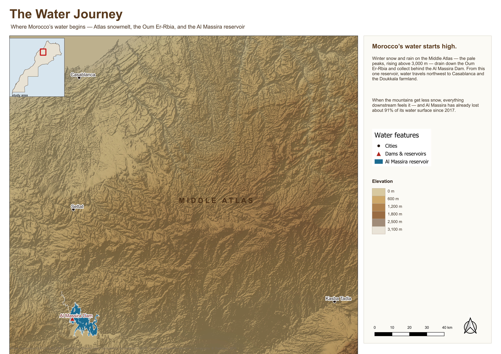

Built in `src/qgis_water_journey.py` (terrain in `src/fetch_dem.py`). A lighter
terrain map (`src/qgis_basin_map.py`, over OpenTopoMap) and an interactive folium
version (`figures/oum_er_rbia_map.html`) are also included.

## Where I'm from

I did not start with Al Massira. I started at home. I am from the **Souss valley and the
Anti-Atlas** of southern Morocco (Taroudant, in Souss-Massa) — a dry land between two
mountain ranges that has grown drier in my lifetime. Where families once farmed, there is
now only enough water to drink and to wash; the one tree that endures is the **argan**.
When the water fails, people leave. The people losing their homes did least to warm the
climate — which is why, to me, this is a question of **environmental justice**.

Al Massira, in the north, is where I proved I could measure a water crisis honestly. The
reason behind it is here, in the south.

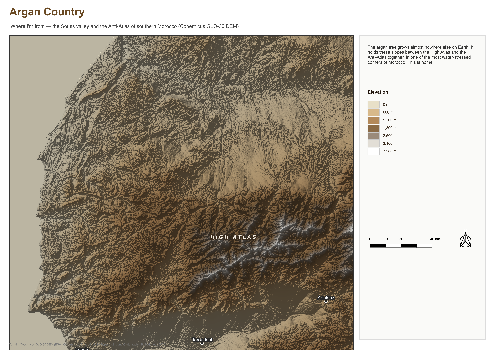

*Home ground — a QGIS shaded-relief layout (hillshade + hypsometric tint) from the open
Copernicus GLO-30 DEM. `src/build_home_map.py` fetches the DEM; `src/qgis_argan_terrain.py`
renders the print layout.*

### Measuring the drying — a spatial view

**Where the land browned.** I mapped the change in spring vegetation (Sentinel-2 NDVI)
between 2018 and 2026 across the argan slopes, over satellite imagery. The browning (drier)
concentrates in the western drainages; the signal is patchy and honest, not a uniform
collapse. This is a multi-source GIS workflow — two years of NDVI reprojected from UTM to a
common lat/lon grid, differenced into a GeoTIFF (`src/build_greenness_map.py`), then styled as
a QGIS print layout with legend, scale bar and north arrow (`src/qgis_greenness.py`).

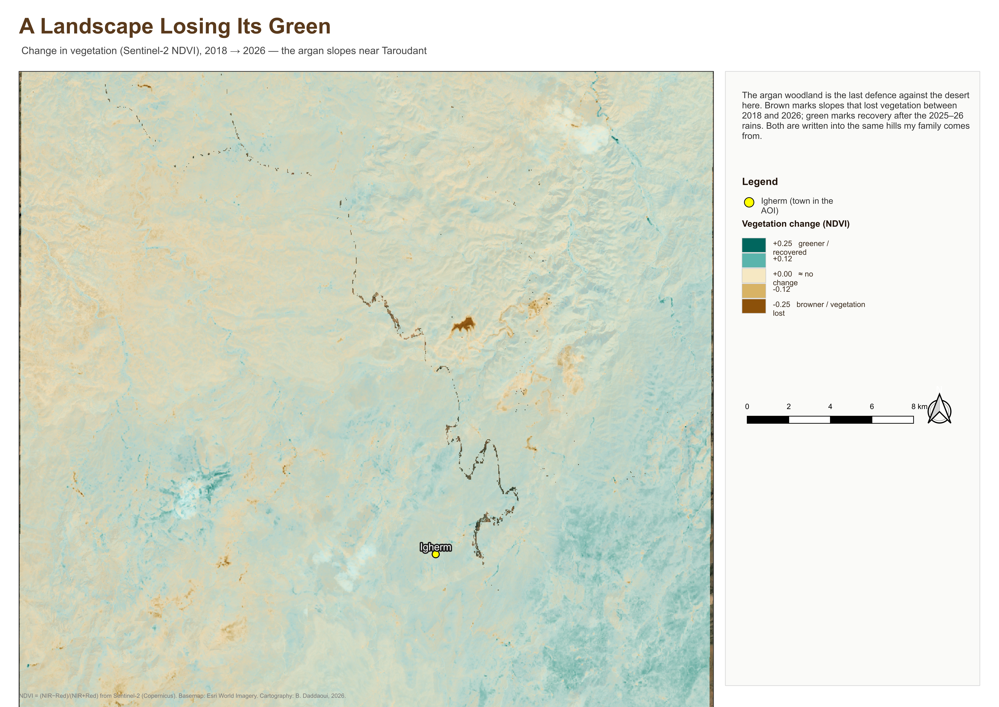

**Rainfall is the driver, over a longer record.** Annual rainfall near Taroudant has fallen
about **17 mm/decade** over 35 years, and the recent decade (2015+) averaged **~31% less
rain** than the 1990s (264 → 181 mm).

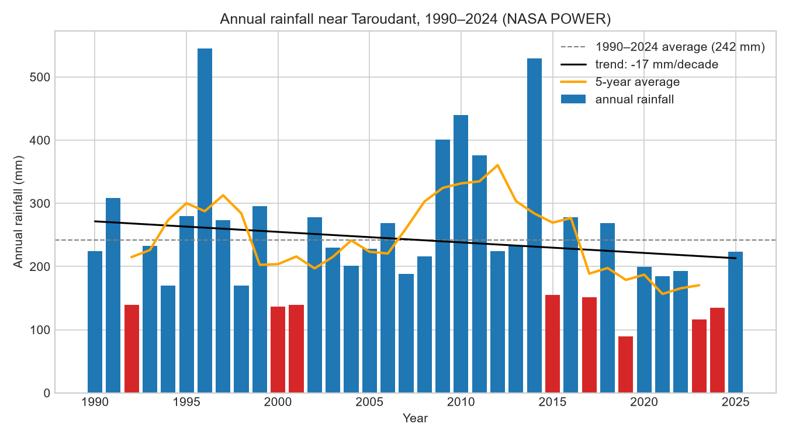

**And 25 years of vegetation, from MODIS.** Sentinel-2 only reaches back to 2015, so to ask
whether the land itself is drying over the long run I pulled a **25-year MODIS NDVI record
(2000–2026)** for the argan slopes. It shows a modest downward trend, a clear decline of the
5-year average through the 2015–2024 drought (~0.19 → ~0.145), then a sharp rebound in the wet
2026 — greenness here is real but rainfall-driven and resilient, not collapsing. This is the
honest long answer the 9-year Sentinel-2 record alone couldn't give.

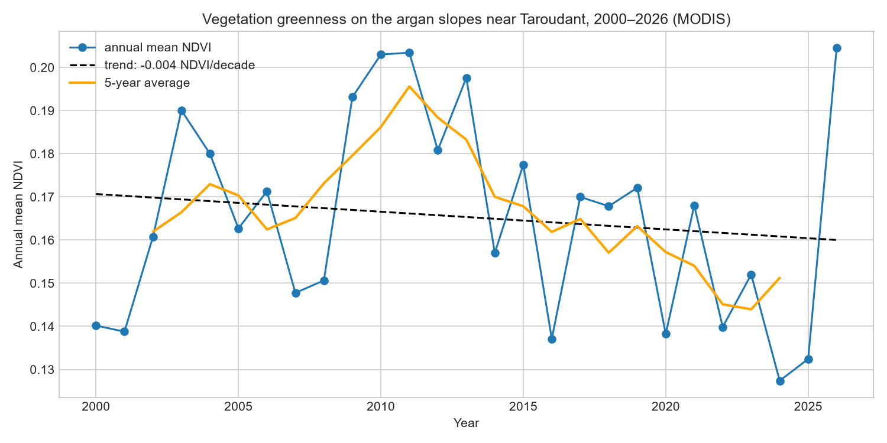

Built in `src/measure_modis_ndvi.py` (ORNL MODIS Web Service — no login, so anyone can rerun
it; NASA's `earthaccess` library is the scalable cloud-native alternative I evaluated).

**Land cover, classified.** To see *what* is on the land, I ran an unsupervised **K-means
classification** of a spring Sentinel-2 scene into land-cover classes. The argan woodland and
irrigated valley vegetation separate cleanly from bare soil and rock — the green tracing the
wadis and slopes. Output as a classified GeoTIFF (`src/classify_landcover.py`); labels are
interpreted from the clusters' spectral signatures (an honest unsupervised classification,
not a ground-truthed map). Classified to a GeoTIFF in `src/classify_landcover.py`, then
rendered as a QGIS print layout with named classes and areas in `src/qgis_landcover.py`.

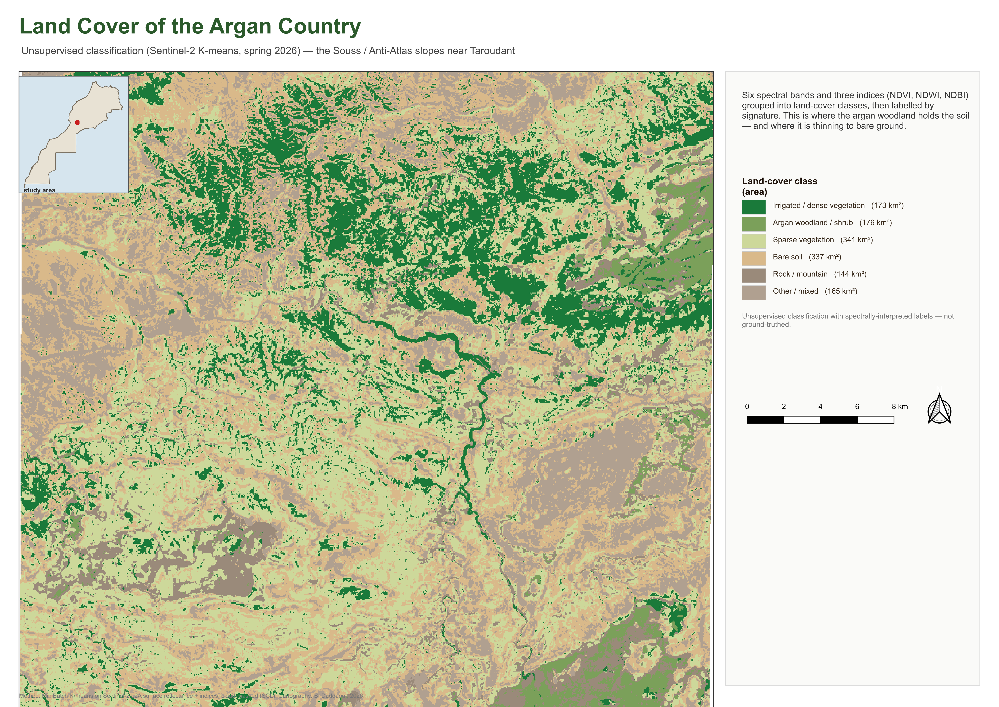

## GIS skills demonstrated

Beyond the story, this repo is a portfolio of core GIS-technician competencies — each mapped
to where it lives:

| Competency | Where it's demonstrated |
|---|---|
| **QGIS** cartography | `src/qgis_*.py`, `qgis/*.qgz`, the maps in `figures/` |
| **ArcGIS Pro / arcpy** automation | `arcgis/build_arcgis_project.py` — loads the geodatabase + rasters into ArcGIS Pro |
| **Coordinate systems** & spatial data | [METADATA.md](METADATA.md) — EPSG 4326 / 32629 / 32630 / 3857, with reprojection lineage |
| Enter, edit & maintain **spatial + attribute data** | `src/build_geodatabase.py` → `gis/morocco_water.gpkg` (attributed layers) |
| **Digitising** into a GIS database | reservoir shorelines vectorised from Sentinel-2 (`src/export_reservoir_vectors.py`) |
| **Remote-sensing classification** | `src/classify_landcover.py` → land-cover GeoTIFF + map |
| **Multi-temporal / time-series RS** | 25-year MODIS NDVI + 10-year Sentinel-2 reservoir series (`src/measure_modis_ndvi.py`, `src/measure_reservoir.py`) |
| **Web GIS / interactive mapping** | leafmap interactive map (`src/build_interactive_map.py` → `storymap/interactive_map.html`) |
| **QA/QC** & verifying accuracy / completeness | `src/qa_qc.py` → [QA_QC_REPORT.md](QA_QC_REPORT.md) — 21/21 checks pass |
| Prepare **maps & cartographic outputs** | the QGIS + Python maps throughout |
| Organise & maintain GIS **files / databases** | GeoPackage geodatabase, GeoTIFF, documented metadata |
| **AutoCAD** interoperability | `gis/morocco_water.dxf` (DXF export) |
| Attention to **detail & accuracy** | areas measured in UTM (not degrees); honest, documented limits in [HOW-AND-WHY.md](HOW-AND-WHY.md) |

Reproduce: `python src/build_geodatabase.py && python src/qa_qc.py`

## A Desert in Disguise — Souss-Massa in four maps

My home region, told in the structure National Geographic uses for its
[California: A Desert in Disguise](https://education.nationalgeographic.org/resource/california-desert-disguise/)
lesson — **Supply → Delivery → Use**, plus the fourth "untold" panel that lesson
challenges you to design yourself. Same method, my own region, my own data.

**1 · Supply — where the rain falls.** Mountains decide who gets water. Atlantic moisture
climbs the High Atlas and rains out on the windward north; by the time the air crosses to the
leeward Souss and Anti-Atlas it is wrung dry. Measured from NASA POWER: the far south gets
**99 mm/yr against 287 mm/yr in the northern mountains — 65% less**. This is the orographic
rain shadow taught in NatGeo's *Precipitation Across Landscapes*, measured rather than assumed.

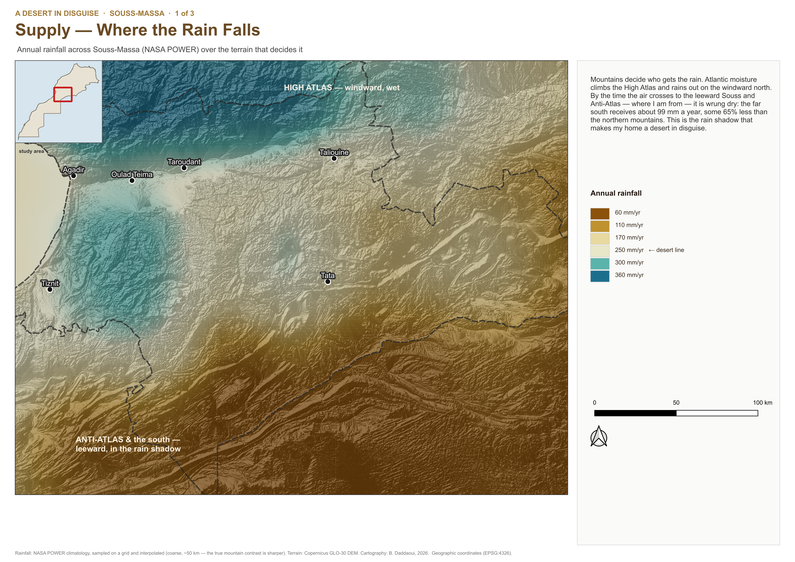

**2 · Delivery — how the water travels.** The Souss valley is the corridor between the High
Atlas and the Anti-Atlas that gathers what little falls and carries it west to the Atlantic.
That narrow strip is where nearly everyone lives, and where the farms are.

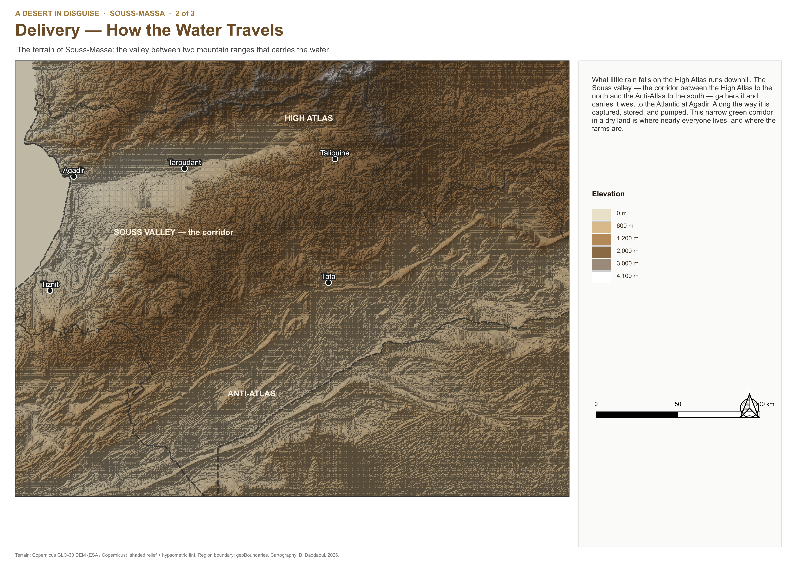

**3 · Use — where the water goes.** Here is the disguise. In a plain with desert-level
rainfall, roughly **162,000 hectares** glow green — citrus and greenhouse vegetables, much of
it exported. That green is not rain-fed; it is pumped, largely from the Souss aquifer.

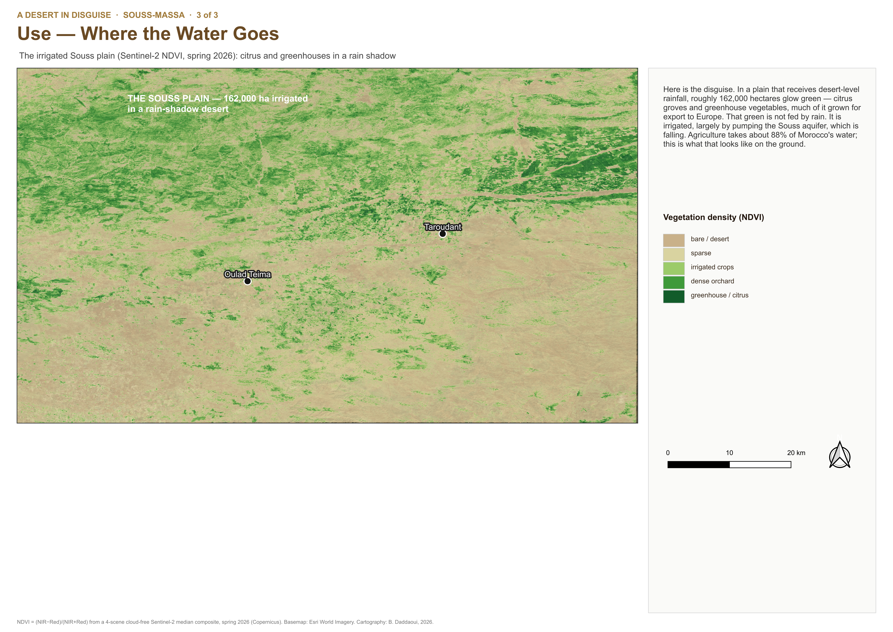

**4 · The Cost — and the control test that changed the answer.** Comparing 2018 with 2026, the
irrigated area appeared to grow **+46%**. That was wrong, and finding out why is the most
important analysis in this repo. 2026 was an exceptionally wet year, so I tested a **control**:
bare desert that nobody irrigates. It greened by **+0.09 NDVI** — pure rainfall. Rangeland was
simply crossing my NDVI threshold after rain, not becoming farmland.

Measured against that rainfall baseline, the land that was **already farmland in 2018 is
−0.25 NDVI lower in 2026**. Even in a record wet year, the established farms lost green.

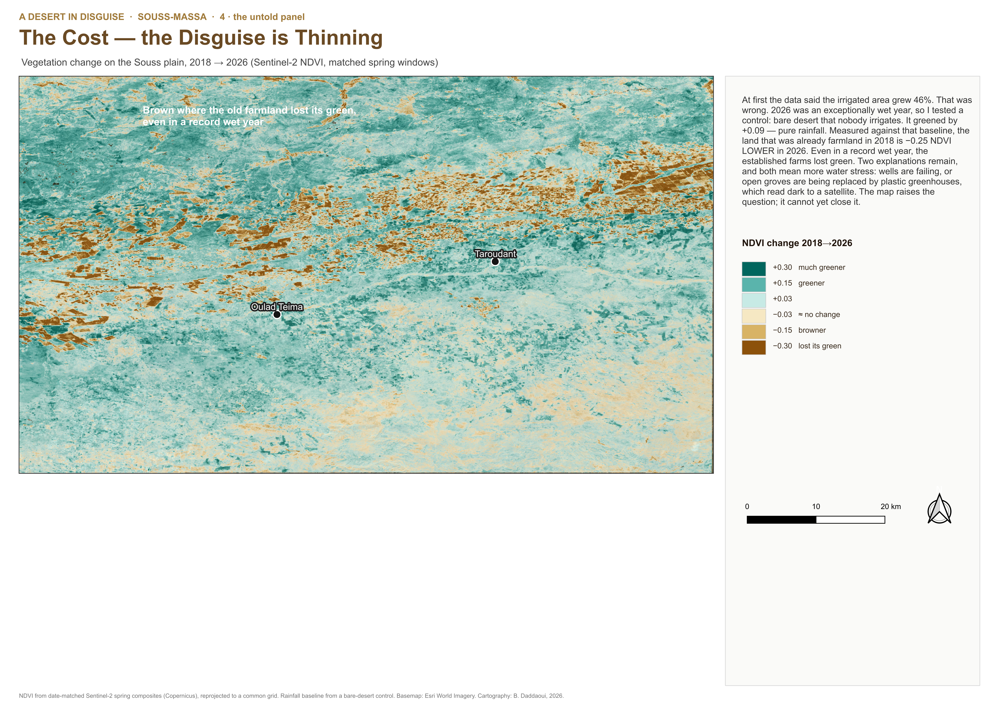

Two explanations remain and I cannot separate them with NDVI alone — wells failing, or open
groves being replaced by plastic greenhouses, which read dark to a satellite. Both point the
same way: more water stress. The honest position is that this map **raises** the question
rather than closing it; distinguishing the two needs SWIR-based plastic detection or field data.

| | Mean NDVI change 2018→2026 | vs rainfall baseline |
|---|---|---|
| Bare desert (control) | **+0.094** | — (this *is* the baseline) |
| Sparse rangeland | +0.061 | −0.034 |
| Farmland in 2018 | **−0.160** | **−0.255** |

Built by `src/fetch_souss_dem.py`, `src/measure_rainshadow.py`,
`src/measure_souss_agriculture.py`, `src/measure_souss_change.py`, and rendered in QGIS by
`src/qgis_souss_triptych.py`. Method note: the two years use **date-matched spring windows**
(20 Mar – 15 May) so crop growth stage is comparable — before that correction the apparent
change was inflated to +119%.

## Spatial SQL and cloud-native vector (DuckDB + GeoParquet)

Modern spatial data science happens in a database, not a folder of files.
`src/pipeline_spatial_sql.py` runs real spatial SQL over the geodatabase using **DuckDB with
its spatial extension** — server-free, but the same `ST_*` functions you would write against
**PostGIS** — and publishes the result as **GeoParquet**, the cloud-native vector format that
replaces the shapefile.

Queries used: `ST_Area`, `ST_Distance`, `ST_DWithin`, `ST_Union_Agg`, `ST_Centroid`,
`ST_Transform` — with every measurement taken in **UTM 29N (EPSG:32629)**, never in degrees.
Irrigated Doukkala cropland is vectorised from the NDMI raster into field polygons first, so
the query answers a real question: *which farmland and which communities are exposed as the
reservoir retreats?*

**The SQL is validated against an independent measurement** — and that check caught a real bug:

| Al Massira surface | 2017 | 2024 |
|---|---|---|
| Measured from Sentinel-2 | 98.8 km² | 9.4 km² |
| DuckDB `ST_Transform` (default) | 204.5 km² ✗ | 19.6 km² ✗ |
| DuckDB with `always_xy := true` | **98.8 km² ✓** | **9.4 km² ✓** |

DuckDB's `ST_Transform` honours the *official* EPSG:4326 axis order — **(latitude, longitude)**
— not the (longitude, latitude) that GeoJSON, shapely and geopandas use. Without
`always_xy := true` it silently swaps coordinates and every area and distance is wrong by ~2×,
with no error raised. Nothing but cross-validation against an independent number would have
caught it. This is why the CRS rule in [CLAUDE.md](CLAUDE.md) exists.

## Cloud-native geospatial (COG) and agentic-coding practice

This project **reads** Cloud Optimized GeoTIFFs already: every Sentinel-2 scene is a COG on S3,
which is why a windowed read can pull one small area out of a 100 km scene without downloading
it. `src/make_cogs.py` closes the loop by making the project's own outputs COGs too — internally
tiled (512x512), pyramided, and compressed — then **re-opening every file to validate it** rather
than assuming the write worked:

```
12/12 outputs validated as Cloud Optimized GeoTIFF
```

The pyramids are not decoration. Reading a thumbnail of `souss_change.tif` is **21x faster**
from an overview than reading the full grid (2.8 ms vs 58.5 ms) — that is what lets a COG be
served to a web map or a cloud process efficiently.

The repo also carries a project-level **[CLAUDE.md](CLAUDE.md)** documenting data conventions,
CRS discipline, cartographic standards, and the honesty rules this analysis follows — the
practice taught in Ujaval Gandhi's
[*Agentic Coding for Geospatial*](https://courses.spatialthoughts.com/agentic-coding-geospatial.html)
(Spatial Thoughts), where agentic work is **guided and validated**, never autonomous.

## Does it all hang together? (cross-validation)

Four *independent* measurements — a reservoir, rainfall, crop moisture, and long-term
vegetation — all move together. When independent datasets agree, that is how you know the
story is real and not cherry-picked:

| Signal | Drought (2017 → 2024) | Recovery (2025–26) | Source |
|--------|----------------------|--------------------|--------|
| Reservoir surface | 98 → **9 km²** (−91%) | → **125 km²** (2026) | Sentinel-2 NDWI |
| Rainfall near Taroudant | 2015+ decade ~31% below 1990s | 2025–26 anomalously wet | NASA POWER |
| Doukkala crop moisture | stressed (negative NDMI) | **+0.24** in 2026 | Sentinel-2 NDMI |
| Argan vegetation (25 yr) | 5-yr avg dips through 2015–24 | rebounds in 2026 | MODIS NDVI |

The honest reading is **not** "Morocco is simply drying up." It is **violent volatility** — a
drying long-term baseline, a brutal multi-year drought, and a sharp wet-year recovery. Every
dataset independently agrees. The limits of each are stated plainly in
[HOW-AND-WHY.md](HOW-AND-WHY.md).

## How this connects to real research

The Al Massira decline is well documented in the peer-reviewed literature — including
Moroccan and UM6P-led work on the Oum Er-Rbia basin. My ~91% surface-loss measurement
**independently corroborates** those findings (e.g. a 2025 *Scientific Reports* study
ranking Al Massira among the most-declined Mediterranean reservoirs) and follows the same
NDWI approach as a 2023 study of the reservoir — but with a fully open, reproducible
pipeline. See **[REFERENCES.md](REFERENCES.md)** for the sources and honest framing.

## Supporting national context

Plain charts of the national indicators (World Bank data), for reference only. These are
background — the spatial analysis and maps above are the focus.

<p align="center">
  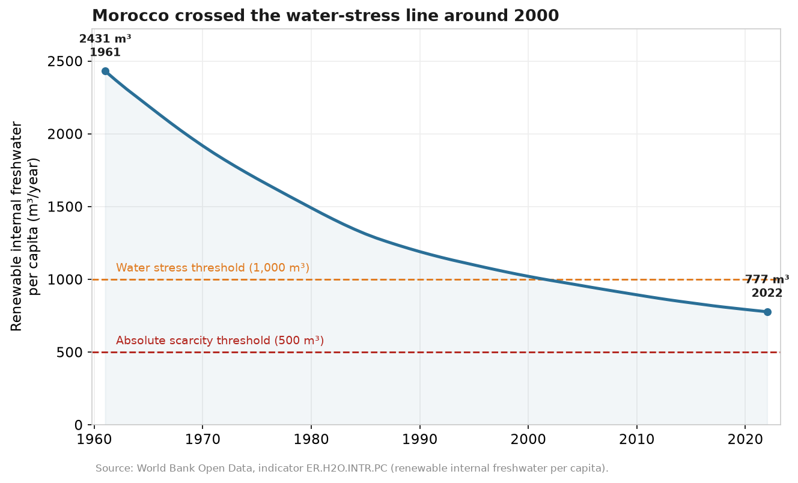
  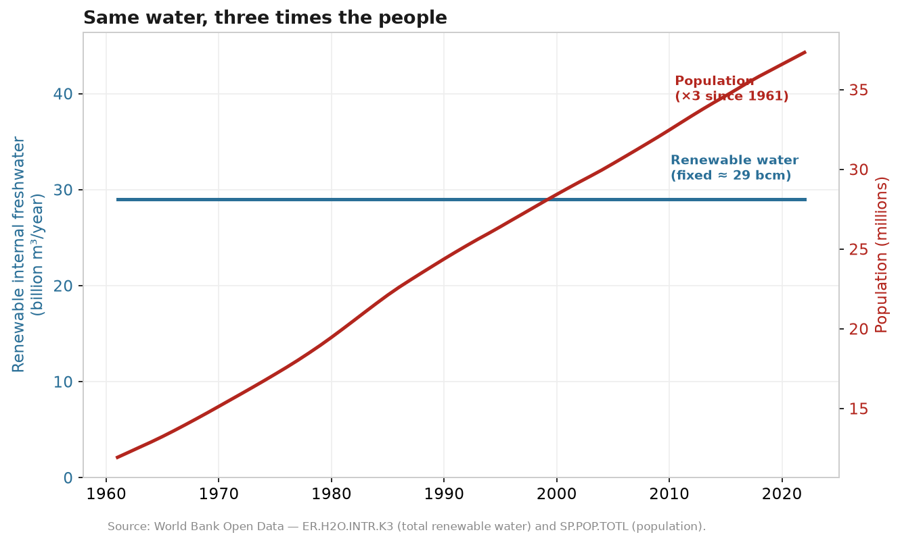
</p>
<p align="center">
  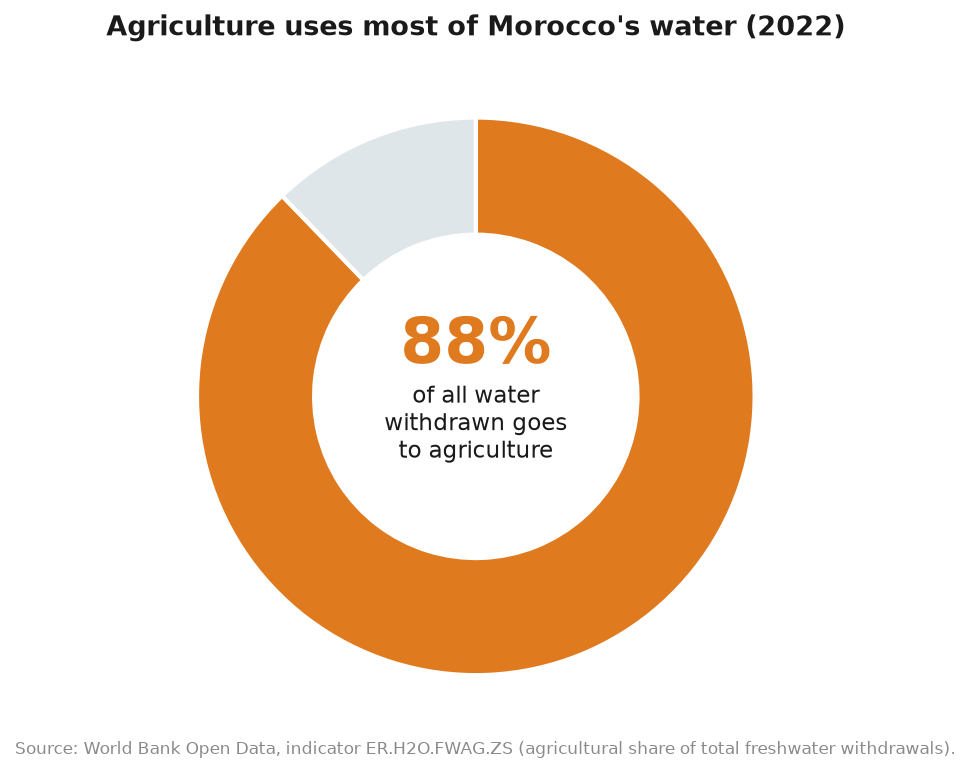
  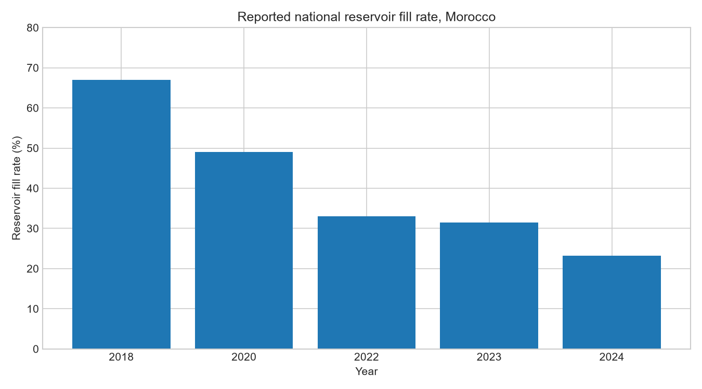
</p>

## Data sources (all public / open)

| Data | Source | Licence |
|------|--------|---------|
| Renewable freshwater per capita, totals, withdrawals, population | [World Bank Open Data](https://data.worldbank.org/country/morocco) API (indicators `ER.H2O.INTR.PC`, `ER.H2O.INTR.K3`, `ER.H2O.FWTL.ZS`, `ER.H2O.FWAG.ZS`, `SP.POP.TOTL`) | CC BY 4.0 |
| Administrative boundaries (ADM0/ADM1) | [geoBoundaries](https://www.geoboundaries.org/) | CC BY 4.0 |
| Satellite imagery (reservoir measurement) | [Sentinel-2 L2A](https://registry.opendata.aws/sentinel-2-l2a-cogs/) via [Earth Search STAC](https://earth-search.aws.element84.com/v1) | open (Copernicus) |
| Terrain / elevation (shaded relief) | [Copernicus GLO-30 DEM](https://registry.opendata.aws/copernicus-dem/) (ESA / Copernicus) | open |
| Basemap terrain | [OpenTopoMap](https://opentopomap.org/) | CC-BY-SA |
| Reservoir fill rates | Figures reported by Moroccan authorities / press (hand-entered, sourced in `data/raw/reservoir_levels_reported.csv`) | reported context |

> Note on provenance: reservoir fill rates are **not** from the World Bank API —
> they are reported figures, kept in a clearly-labelled separate file so the
> API-derived indicators stay clean. No private or basin-agency research data is
> included in this repository.

## Reproduce it

```bash
pip install -r requirements.txt

python src/fetch_worldbank.py          # pull indicators from the World Bank API
python src/fetch_geodata.py            # download open Morocco boundaries
python src/build_figures.py            # national charts -> figures/
python src/build_map.py                # static + interactive basin maps
python src/build_reservoir_figures.py  # Sentinel-2 Al Massira analysis (downloads imagery)
python src/export_reservoir_vectors.py # vectorise water masks -> GeoPackage
python src/fetch_truecolor.py          # true-colour 2017/2024 crops for the swipe
python src/build_home_map.py           # "Argan Country" home-region terrain map
python src/measure_rainfall.py         # 35-yr rainfall trend near home (NASA POWER)
python src/measure_greenness.py        # spring NDVI trend on the argan slopes (Sentinel-2)
python src/measure_modis_ndvi.py       # 25-year MODIS NDVI record 2000-2026 (ORNL, no login)
python src/measure_crop_stress.py      # Doukkala crop water stress (Sentinel-2 NDMI)
python src/fetch_souss_dem.py        # Copernicus DEM for the whole Souss-Massa region
python src/measure_rainshadow.py     # rain-shadow precipitation surface (NASA POWER)
python src/measure_souss_agriculture.py  # irrigated area of the Souss plain (Sentinel-2)
python src/measure_souss_change.py   # irrigated change 2018-2026 + rainfall control
python src/build_greenness_map.py      # NDVI-change GIS map over a DEM hillshade
python src/classify_landcover.py       # unsupervised land-cover classification (Sentinel-2)
python src/build_geodatabase.py        # attributed GeoPackage geodatabase (+ DXF)
python src/qa_qc.py                    # QA/QC report on the geodatabase
python src/fetch_dem.py                # Copernicus 30m DEM for shaded relief
python src/build_method_figures.py     # teaching figures: NDWI/Otsu histogram, area vs volume
python src/build_reservoir_gif.py      # animated timelapse GIF
python src/build_storymap.py           # self-contained scrollytelling page

# these run inside QGIS (Plugins -> Python Console), not the plain venv:
#   src/qgis_basin_map.py          terrain map of the basin
#   src/qgis_reservoir_layout.py   high-res 2017-vs-2024 satellite map
#   src/qgis_community_map.py       "who depends on Al Massira" map
#   src/qgis_water_journey.py       shaded-relief + hypsometric terrain map
```

## Repository layout

```
morocco-water-stress/
├── src/                 data fetch, analysis, figure/map/GIF/story builders
├── data/
│   ├── raw/             World Bank JSON, reported reservoir + community CSVs
│   ├── processed/       tidy indicator CSVs, reservoir areas + masks
│   └── geo/             open boundaries + measured water GeoPackage
├── figures/             all charts, maps, the timelapse GIF, PDFs
├── qgis/                QGIS projects (terrain, reservoir, community maps)
├── notebooks/           narrative walkthrough
├── storymap/            self-contained scrollytelling StoryMap page
└── REFERENCES.md        how this connects to peer-reviewed research
```

## Why this project

Water is Morocco's defining environmental challenge, and it is also a community
one: who gets water, for which crops, in which basin. This repo is a small,
honest attempt to make that visible with open data and reproducible code.
