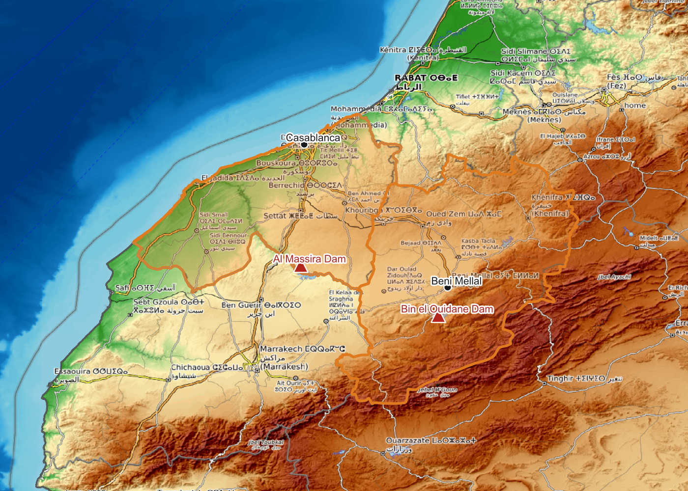

# Running Dry: Mapping Water Stress in Morocco

Morocco is one of the most water-stressed countries in the world. This project
uses open data to tell that story at two scales — the national trend since 1961,
and a zoom into the **Oum Er-Rbia basin**, whose Al Massira reservoir supplies
Casablanca and the Doukkala irrigated plain.

Everything here is built from **public, openly licensed data** and is fully
reproducible from the scripts in `src/`.


> *The headline result: I measured the Al Massira reservoir's water surface from
> Sentinel-2 imagery. The cyan line is its 2017 shoreline; the dark blue is all
> that remained in 2024 — a 91% loss. High-resolution QGIS map; the analysis is
> [below](#measuring-the-crisis-from-space-the-al-massira-reservoir).*

## What the data shows

- **Al Massira reservoir — which supplies Casablanca — lost 91% of its water
  surface between 2017 and 2024**, measured directly from Sentinel-2 satellite
  imagery (see [below](#measuring-the-crisis-from-space-the-al-massira-reservoir)).
- **Morocco crossed the international water-stress line (1,000 m³/person/year)
  around the year 2000.** Renewable internal freshwater fell from **2,431 m³ per
  person in 1961 to 777 m³ in 2022** — a 68% drop — and is now closer to the
  "absolute scarcity" threshold of 500 m³.
- **The water didn't shrink — the population did the opposite.** Total renewable
  internal freshwater has been essentially flat (~29 billion m³/year) while the
  population roughly tripled, from ~12 million to ~38 million. The per-capita
  collapse is driven by demand, not by a falling water supply — with drought
  making the *usable* share smaller still.
- **Agriculture uses about 88% of all water withdrawn** (2022), so any serious
  response to water stress is also a conversation about farming, subsidised
  water-intensive crops, and rural livelihoods.
- **The drought is visible in the dams.** Reported national reservoir fill rates
  fell to around **23% in 2024**, down from ~31% in 2023 — the lowest in years.

<p align="center">
  
  
</p>

## Measuring the crisis from space: the Al Massira reservoir

The national numbers become concrete in one place. The Oum Er-Rbia rises in the
Middle Atlas, is stored behind the **Al Massira Dam** — Morocco's second-largest
reservoir — and supplies drinking water to **Casablanca** and irrigation to the
**Doukkala plain**. So I measured it directly.

Using **Sentinel-2** satellite imagery, I computed the reservoir's open-water
surface area for every dry season from 2017 to 2025 (NDWI water index + an
automatic Otsu threshold, cloud-masked with the scene classification band). The
result is not a reported statistic — it is a measurement:

**Al Massira's water surface fell from ~98 km² (2017) to ~9 km² (2024) — a 91%
collapse — before a partial recovery to ~25 km² after the wetter 2024–25 winter.**


This is built in `src/measure_reservoir.py` (measurement) and
`src/build_reservoir_figures.py` (figures), from public Sentinel-2 L2A data via
the open [Earth Search](https://earth-search.aws.element84.com/v1) STAC API — no
Earth Engine account or paid service required. The method follows the published
remote-sensing literature on Al Massira and other Mediterranean reservoirs.

The water extents are vectorised (`src/export_reservoir_vectors.py`) and mapped
in **QGIS** as a high-resolution print layout (`src/qgis_reservoir_layout.py`,
project `qgis/al_massira_reservoir.qgz`) — the hero map at the top of this
README, exported at 300 dpi as PNG and print-ready PDF.

### Who depends on this water — the community connection

A shrinking reservoir is a human story, not just a hydrological one. Al Massira is
a key water source for the **Casablanca-Settat region (7.7 million people, 2024
census)** and irrigates the **Doukkala plain (~96,000 ha of farmland)** through the
Oum Er-Rbia system — and it is a **Ramsar wetland of international importance** for
birds and biodiversity. This QGIS map connects the 91% water loss to the people and
land that rely on it.


Built in `src/qgis_community_map.py` from open census (HCP Morocco), irrigation
(ORMVAD), and the Sentinel-2 reservoir extents; community figures are documented
with sources in `data/raw/communities_al_massira.csv`.

### The basin in context



The terrain map is scripted with **PyQGIS** (`src/qgis_basin_map.py`) over
OpenTopoMap; a lighter Python version (`src/build_map.py`) produces both a static
map and an interactive `figures/oum_er_rbia_map.html`.

## How this connects to real research

The Al Massira decline is well documented in the peer-reviewed literature — including
Moroccan and UM6P-led work on the Oum Er-Rbia basin. My ~91% surface-loss measurement
**independently corroborates** those findings (e.g. a 2025 *Scientific Reports* study
ranking Al Massira among the most-declined Mediterranean reservoirs) and follows the same
NDWI approach as a 2023 study of the reservoir — but with a fully open, reproducible
pipeline. See **[REFERENCES.md](REFERENCES.md)** for the sources and honest framing.

## Data sources (all public / open)

| Data | Source | Licence |
|------|--------|---------|
| Renewable freshwater per capita, totals, withdrawals, population | [World Bank Open Data](https://data.worldbank.org/country/morocco) API (indicators `ER.H2O.INTR.PC`, `ER.H2O.INTR.K3`, `ER.H2O.FWTL.ZS`, `ER.H2O.FWAG.ZS`, `SP.POP.TOTL`) | CC BY 4.0 |
| Administrative boundaries (ADM0/ADM1) | [geoBoundaries](https://www.geoboundaries.org/) | CC BY 4.0 |
| Satellite imagery (reservoir measurement) | [Sentinel-2 L2A](https://registry.opendata.aws/sentinel-2-l2a-cogs/) via [Earth Search STAC](https://earth-search.aws.element84.com/v1) | open (Copernicus) |
| Basemap terrain | [OpenTopoMap](https://opentopomap.org/) | CC-BY-SA |
| Reservoir fill rates | Figures reported by Moroccan authorities / press (hand-entered, sourced in `data/raw/reservoir_levels_reported.csv`) | reported context |

> Note on provenance: reservoir fill rates are **not** from the World Bank API —
> they are reported figures, kept in a clearly-labelled separate file so the
> API-derived indicators stay clean. No private or basin-agency research data is
> included in this repository.

## Reproduce it

```bash
pip install -r requirements.txt

python src/fetch_worldbank.py   # pull indicators from the World Bank API
python src/fetch_geodata.py     # download open Morocco boundaries
python src/build_figures.py     # national charts -> figures/
python src/build_map.py         # static + interactive basin maps
python src/build_reservoir_figures.py  # Sentinel-2 Al Massira analysis (downloads imagery)
# src/qgis_basin_map.py runs inside QGIS (Python console) for the terrain map
```

## Repository layout

```
morocco-water-stress/
├── src/                 data fetch + figure/map builders
├── data/
│   ├── raw/             raw World Bank JSON + reported reservoir CSV
│   ├── processed/       tidy indicator CSVs
│   └── geo/             open Morocco boundaries (geoBoundaries)
├── figures/            all charts + maps (PNG, interactive HTML)
├── qgis/               QGIS project for the terrain map
└── notebooks/          narrative walkthrough
```

## Why this project

Water is Morocco's defining environmental challenge, and it is also a community
one: who gets water, for which crops, in which basin. This repo is a small,
honest attempt to make that visible with open data and reproducible code.
